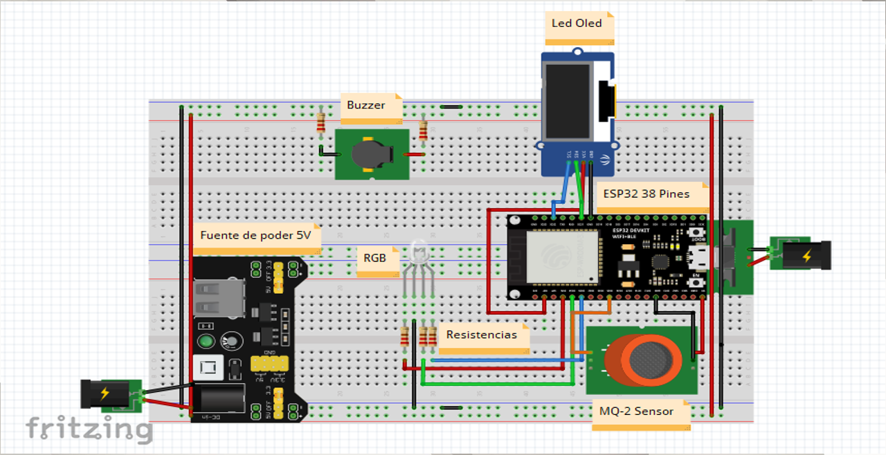
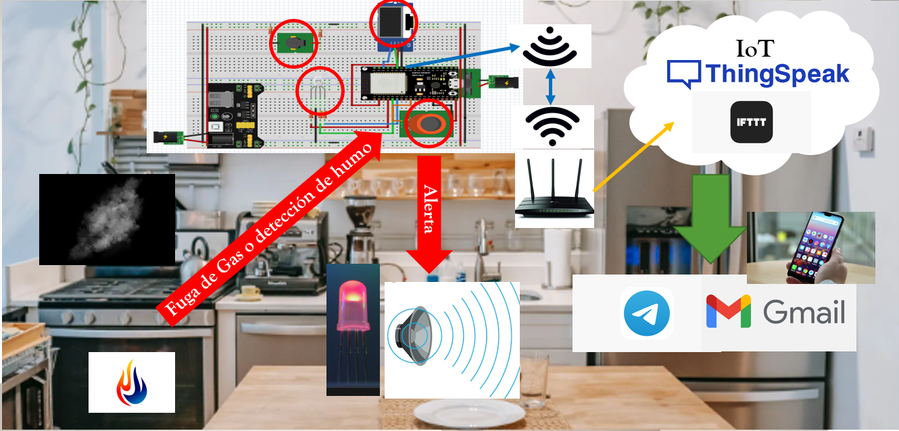

# CObot

## 📦 Packages

## 🤖 Por que CObot?

Cobot nace bajo la necesidad de generar un sistema que permita la prevención de incendios.

### Diseño de prototipo

#### Imagen prototipo

#### Materiales usados

Para los materialaes utilizados tenemos los siguientes componentes:
1. ESP32
2. Sensor MQ2
3. Modulo OLED
4. RGB
5. Buzzer
6. Protoboard
7. Cables jumpers.

## Instalación

Instalar MicroPython:
- [ ] https://www.esploradores.com/instalacion_micropython/

## Historial de versiones

* 0.0.1
    * Generacion de respositorio.
* 0.0.2
    * Generacion de archivos iniciales.
* 1.0.0
    * Seperacion por modulos del codigo.
